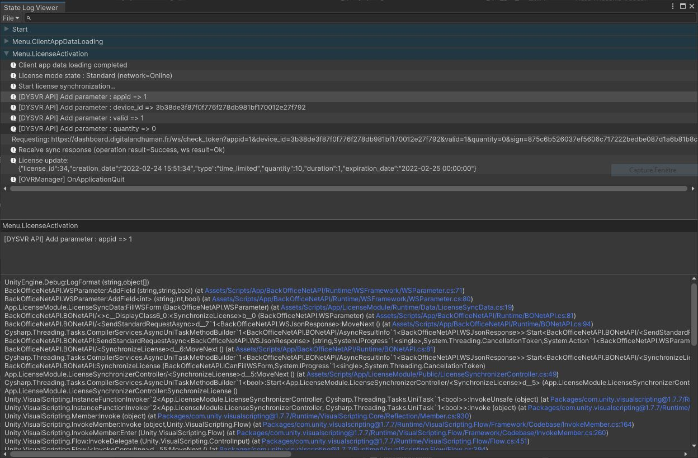

# State Log

Allow to divide logs into states (setup from your code) and read easily from a special log file thanks to the State Log Viewer.

## Usage

To setup a state, just call : `SLog.StartStep("MyState");` . After that, every logs generated will go in this category.

Most of the time, you will want to call this from your flow manager.

Run your application. When the application is closed, a file is generated `{Application.persistentDataPath}/StateLogs/StateLog_X.json`.

### Notes

- The output path should be displayed in the logs if you cannot find it.
- If log calls are catched but no state has been set, the logs will goes in a default state "Uncategorized".
- The State Log generation is based on `Application.logMessageReceived` so it may miss logs at the very beginning or if a crash occurs.

## State Log Viewer

- Open State Log Viewer from the Tools menu.
- `File > Open...` and select your state log file.
- Navigate by selecting a state, then select a log line to get more information.

*Here, we used `SLog.StartStep("Start")`, `SLog.StartStep("Menu.ClientAppDataLoading")` and `SLog.StartStep("Menu.LicenseActivation")`. All logs generated after these calls are put in this state.*

